### Architecture diagram
<!-- luffy-mermaid -->

_Auto-generated from 6 changed file(s) (F57). Edges between groups are adjacency, not proven runtime dependencies._

```mermaid
flowchart LR
  %% PR #1 changed modules (6 files, 1 groups)
  subgraph g_internal["internal"]
    f_internal_flushcommon_writebuffer_write_buffer_test_go["write_buffer_test.go"]
    %% internal/flushcommon/writebuffer/write_buffer_test.go
    f_internal_querynodev2_delegator_delegator_test_go["delegator_test.go"]
    %% internal/querynodev2/delegator/delegator_test.go
    f_internal_streamingnode_server_wal_interceptors_shard_function_["function_materializer.go"]
    %% internal/streamingnode/server/wal/interceptors/shard/function_materializer.go
    f_internal_streamingnode_server_wal_interceptors_shard_shard_int["shard_interceptor_test.go"]
    %% internal/streamingnode/server/wal/interceptors/shard/shard_interceptor_test.go
    f_internal_util_function_manager_go["manager.go"]
    %% internal/util/function/manager.go
    f_internal_util_function_manager_test_go["manager_test.go"]
    %% internal/util/function/manager_test.go
  end
```

Files in diagram

- `internal/flushcommon/writebuffer/write_buffer_test.go`
- `internal/querynodev2/delegator/delegator_test.go`
- `internal/streamingnode/server/wal/interceptors/shard/function_materializer.go`
- `internal/streamingnode/server/wal/interceptors/shard/shard_interceptor_test.go`
- `internal/util/function/manager.go`
- `internal/util/function/manager_test.go`

