<!-- luffy-description -->
<!-- Generated by Luffy F58 pr_description_filler (deterministic; edit freely) -->

## Summary

luffy-eval: #51991 skip insert body parsing without functions

**Type:** Enhancement · **Scope:** 6 file(s), +104/−37 · 2 production path(s) · 4 test path(s)

## Changes

- `internal/flushcommon/writebuffer/write_buffer_test.go` (+13/−1)
- `internal/querynodev2/delegator/delegator_test.go` (+14/−2)
- `internal/streamingnode/server/wal/interceptors/shard/function_materializer.go` (+2/−9)
- `internal/streamingnode/server/wal/interceptors/shard/shard_interceptor_test.go` (+3/−1)
- `internal/util/function/manager.go` (+26/−7)
- `internal/util/function/manager_test.go` (+46/−17)

## Test plan

- [ ] Run the added/updated tests locally or in CI
- [ ] Diff matches intended behavior (no drive-by refactors left unexplained)

## Linked issues

- #51991

## Architecture

_Auto diagram from changed paths (F57); edges are adjacency, not deps._

```mermaid
flowchart LR
  %% PR #1 changed modules (6 files, 1 groups)
  subgraph g_internal["internal"]
    f_internal_flushcommon_writebuffer_write_buffer_test_go["write_buffer_test.go"]
    %% internal/flushcommon/writebuffer/write_buffer_test.go
    f_internal_querynodev2_delegator_delegator_test_go["delegator_test.go"]
    %% internal/querynodev2/delegator/delegator_test.go
    f_internal_streamingnode_server_wal_interceptors_shard_function_["function_materializer.go"]
    %% internal/streamingnode/server/wal/interceptors/shard/function_materializer.go
    f_internal_streamingnode_server_wal_interceptors_shard_shard_int["shard_interceptor_test.go"]
    %% internal/streamingnode/server/wal/interceptors/shard/shard_interceptor_test.go
    f_internal_util_function_manager_go["manager.go"]
    %% internal/util/function/manager.go
    f_internal_util_function_manager_test_go["manager_test.go"]
    %% internal/util/function/manager_test.go
  end
```

---
_Scaffold only — replace bullets with intent/risk notes before merge._
<!-- /luffy-description -->
