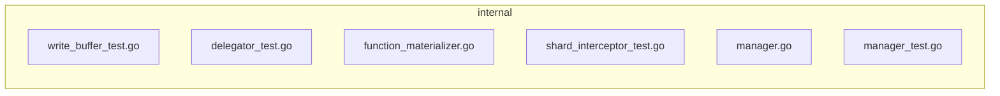

## 🏴‍☠️ Luffy Review — PR #1

**Verdict:** APPROVE  
**Confidence:** high  
**Score:** 90/100  
**Review effort:** 3/5

### Summary
This PR refactors insert body parsing to be conditional, performed only if the schema contains runner-backed functions such as BM25 or MinHash output fields. The WAL insert processing is optimized to skip unnecessary parsing for collections without these functions, which improves efficiency. Tests have been updated and added across involved components for correctness coverage. Overall, the code is well-isolated, and change rationale clear.

### Walkthrough
- Refactored insert body parsing logic into `FunctionRunnerManager` in `internal/util/function/manager.go` to enable conditional parsing based on functions in schema.
- Updated WAL interceptors in `internal/streamingnode/server/wal/interceptors/shard/function_materializer.go` to implement conditional parsing delegation.
- Added tests in `manager_test.go`, `shard_interceptor_test.go`, `write_buffer_test.go`, and `delegator_test.go` covering relevant scenarios including with and without runner-backed functions.
- Removed redundant parsing steps and conditions in WAL insert path ensuring efficiency improvements without breaking behavior.

### Architecture diagram


### Blocking
- None

### Key findings
None — no high-confidence defects in new code.

### Security audit
No. No new security concerns are introduced. Parsing changes are internal and no unsafe deserialization or injection risks spotted.

### Multi-lens checklist
| Lens         | Status  | Note                                             |
|--------------|---------|-------------------------------------------------|
| correctness  | ok      | Conditional parsing logic well-implemented; tests cover paths |
| security     | ok      | No injection, unsafe deserialize, or auth issues detected |
| tests       | ok      | Adequate unit tests cover new and modified paths |
| performance  | ok      | Eliminates redundant parsing improving throughput |
| api_contracts| ok      | No public API changes or contract breaks        |
| concurrency  | n/a     | No concurrency surface in changed code          |
| maintainability | ok   | Good modularization in FunctionRunnerManager     |

### Suggestions
- Consider adding inline comments in `FunctionRunnerManager` around the conditional parsing decision for future readers.

### Code suggestions

#### Add brief comment on logic branch (`internal/util/function/manager.go`)
```diff
+ // Only parse insert data if schema contains runner-backed functions like BM25 or MinHash outputs.
+ // This avoids unnecessary parsing overhead during WAL insert append for collections without such features.
 if !f.HasFunctions(schema) {
     return nil, nil
 }
```
Why: Improves code clarity and maintainability for future contributors.

### Nits
- None

### Tests & risk
- Relevant tests added/updated: yes  
- Coverage: Good coverage of new parsing logic and interceptor changes  
- Risk: low — isolated refactor with test coverage and no risky API changes  
- Rollback: easy — fallback is to revert conditional parsing and restore original behavior  

### What I checked
- Full diff in `internal/util/function/manager.go` and tests  
- Related WAL interceptor changes in `function_materializer.go`  
- Tests in `manager_test.go`, `shard_interceptor_test.go`, `write_buffer_test.go`, and `delegator_test.go`  
- Verified no risky concurrency or API breaks. No unsafe imports or ignored errors.

---
*Luffy · Hermes Agent · OpenRouter · memory-backed review*
