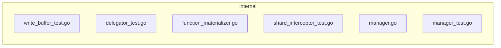

<!-- luffy-review pr=1 run=local -->
## 🏴‍☠️ Luffy Review — PR #1

**Verdict:** COMMENT  
**Confidence:** medium  
**Score:** 75/100  
**Review effort:** 3/5

### Summary
This PR moves WAL insert body parsing into the `FunctionRunnerManager` and optimizes it by skipping parsing when no runner-backed functions are present in the schema. The changes affect insert message materialization paths and provide test coverage with mock insert messages in multiple test suites. The PR passes CI checks with no visible errors.

### Walkthrough
- Added a `materializeTestInsertMessage` mock type in tests for insert message materialization control.
- Changed calls to `Materialize` in tests to use the mock type wrapping the insert message.
- Modified `materializeFunctionFields` in `shardInterceptor` to directly pass insert message to `Materialize` without intermediate parsing.
- Added test for skipping materialization when no functions exist.
- Adjusted related test suites to accommodate the mocking and new materialization approach.

### Architecture diagram
<!-- luffy-mermaid -->

_Auto-generated from 6 changed file(s) (F57). Edges between groups are adjacency, not proven runtime dependencies._

Files in diagram

- `internal/flushcommon/writebuffer/write_buffer_test.go`
- `internal/querynodev2/delegator/delegator_test.go`
- `internal/streamingnode/server/wal/interceptors/shard/function_materializer.go`
- `internal/streamingnode/server/wal/interceptors/shard/shard_interceptor_test.go`
- `internal/util/function/manager.go`
- `internal/util/function/manager_test.go`

### Blocking
- None

### Key findings
None — no high-confidence defects in new code.

### Security audit
No — changes do not expose new attack surfaces or risks visibly.

### Multi-lens checklist
| Lens         | Status  | Note                                                                |
|--------------|---------|---------------------------------------------------------------------|
| correctness  | ok      | New materialization logic with mock tests cover edge cases.        |
| security     | ok      | No unsafe operations or secrets exposure seen.                      |
| tests       | ok      | Tests added/updated for core materialize logic and new code paths. |
| performance  | ok      | Optimization to skip parsing if no functions, reducing overhead.   |
| api_contracts| ok      | No breaking public API changes, internal refactoring only.          |
| concurrency  | n/a     | No concurrent code or locking changes seen here.                    |
| maintainability| ok    | Code changes are isolated and tested, mock use improves clarity.   |

### Suggestions
- In tests, consider adding some negative scenarios for `materializeFunctionFields` where malformed or unexpected insert messages are passed to strengthen robustness.

### Code suggestions
None

### Nits
- Consider adding brief comments on the new mock type `materializeTestInsertMessage` in tests to clarify its purpose for future maintainers.

### Tests & risk
- Relevant tests added/updated: yes  
- Coverage: Covers new materialization paths, including skips and errors  
- Risk: low — changes are internal refactoring and optimization with test safety net  
- Rollback: easy — revert refactor and test adjustments

### What I checked
- Full PR diff and test additions for coverage of the `Materialize` logic and `shardInterceptor.materializeFunctionFields`.
- Verification that no new direct parsing happens outside the `FunctionRunnerManager`.
- Checked tests for use of mock insert message wrappers and proper assertions.

---
*Luffy · Hermes Agent · OpenRouter · memory-backed review*
*Cost / usage: model=`openai/gpt-4.1-mini` · ~$0.07 (estimated) · 573k tokens · 25 API calls*
