### Architecture diagram
<!-- luffy-mermaid -->

_Auto-generated from 8 changed file(s) (F57). Edges between groups are adjacency, not proven runtime dependencies._

```mermaid
flowchart LR
  %% PR #2 changed modules (8 files, 5 groups)
  subgraph g_internal["internal"]
    f_internal_core_src_exec_expression_BloomFilterExpr_cpp["BloomFilterExpr.cpp"]
    %% internal/core/src/exec/expression/BloomFilterExpr.cpp
    f_internal_parser_planparserv2_bloom_match_go["bloom_match.go"]
    %% internal/parser/planparserv2/bloom_match.go
    f_internal_parser_planparserv2_bloom_match_hint_test_go["bloom_match_hint_test.go"]
    %% internal/parser/planparserv2/bloom_match_hint_test.go
  end
  subgraph g_client["client"]
    f_client_milvusclient_bloom_filter_go["bloom_filter.go"]
    %% client/milvusclient/bloom_filter.go
    f_client_sbbf_sbbf_go["sbbf.go"]
    %% client/sbbf/sbbf.go
  end
  subgraph g_configs["configs"]
    f_configs_milvus_yaml["milvus.yaml"]
    %% configs/milvus.yaml
  end
  subgraph g_docs["docs"]
    f_docs_design_docs_design_docs_20260707_bloom_filter_expression_["20260707-bloom-filter-expression.md"]
    %% docs/design-docs/design_docs/20260707-bloom-filter-expression.md
  end
  subgraph g_pkg_util["pkg/util"]
    f_pkg_util_paramtable_component_param_go["component_param.go"]
    %% pkg/util/paramtable/component_param.go
  end
  %% group adjacency (not runtime deps)
  g_internal -.-> g_client
  g_client -.-> g_configs
  g_configs -.-> g_docs
  g_docs -.-> g_pkg_util
```

Files in diagram

- `client/milvusclient/bloom_filter.go`
- `client/sbbf/sbbf.go`
- `configs/milvus.yaml`
- `docs/design-docs/design_docs/20260707-bloom-filter-expression.md`
- `internal/core/src/exec/expression/BloomFilterExpr.cpp`
- `internal/parser/planparserv2/bloom_match.go`
- `internal/parser/planparserv2/bloom_match_hint_test.go`
- `pkg/util/paramtable/component_param.go`

