<!-- luffy-description -->
<!-- Generated by Luffy F58 pr_description_filler (deterministic; edit freely) -->

## Summary

luffy-eval: #51962 raise bloom_match filter ceiling to 50M

**Type:** Enhancement · **Scope:** 8 file(s), +259/−37 · 6 production path(s) · 1 test path(s) · 1 doc path(s)

## Changes

- `client/milvusclient/bloom_filter.go` (+8/−4)
- `client/sbbf/sbbf.go` (+6/−2)
- `configs/milvus.yaml` (+2/−2)
- `docs/design-docs/design_docs/20260707-bloom-filter-expression.md` (+21/−13)
- `internal/core/src/exec/expression/BloomFilterExpr.cpp` (+1/−1)
- `internal/parser/planparserv2/bloom_match.go` (+52/−7)
- `internal/parser/planparserv2/bloom_match_hint_test.go` (+148/−0)
- `pkg/util/paramtable/component_param.go` (+21/−8)

## Test plan

- [ ] Run the added/updated tests locally or in CI
- [ ] Validate workflow/config YAML
- [ ] Diff matches intended behavior (no drive-by refactors left unexplained)

## Linked issues

- #51962

## Architecture

_Auto diagram from changed paths (F57); edges are adjacency, not deps._

```mermaid
flowchart LR
  %% PR #2 changed modules (8 files, 5 groups)
  subgraph g_internal["internal"]
    f_internal_core_src_exec_expression_BloomFilterExpr_cpp["BloomFilterExpr.cpp"]
    %% internal/core/src/exec/expression/BloomFilterExpr.cpp
    f_internal_parser_planparserv2_bloom_match_go["bloom_match.go"]
    %% internal/parser/planparserv2/bloom_match.go
    f_internal_parser_planparserv2_bloom_match_hint_test_go["bloom_match_hint_test.go"]
    %% internal/parser/planparserv2/bloom_match_hint_test.go
  end
  subgraph g_client["client"]
    f_client_milvusclient_bloom_filter_go["bloom_filter.go"]
    %% client/milvusclient/bloom_filter.go
    f_client_sbbf_sbbf_go["sbbf.go"]
    %% client/sbbf/sbbf.go
  end
  subgraph g_configs["configs"]
    f_configs_milvus_yaml["milvus.yaml"]
    %% configs/milvus.yaml
  end
  subgraph g_docs["docs"]
    f_docs_design_docs_design_docs_20260707_bloom_filter_expression_["20260707-bloom-filter-expression.md"]
    %% docs/design-docs/design_docs/20260707-bloom-filter-expression.md
  end
  subgraph g_pkg_util["pkg/util"]
    f_pkg_util_paramtable_component_param_go["component_param.go"]
    %% pkg/util/paramtable/component_param.go
  end
  %% group adjacency (not runtime deps)
  g_internal -.-> g_client
  g_client -.-> g_configs
  g_configs -.-> g_docs
  g_docs -.-> g_pkg_util
```

---
_Scaffold only — replace bullets with intent/risk notes before merge._
<!-- /luffy-description -->
