## 🏴‍☠️ Luffy Review — PR #2

**Verdict:** APPROVE  
**Confidence:** high  
**Score:** 95/100  
**Review effort:** 3/5

### Summary
This PR raises the bloom_match filter ceiling to 50M members by increasing the max filter size and gRPC receive size limits, improving capacity for large bloom filters. It includes modifications across client, config, internal execution, parser, and documentation, with new tests validating sizing and rejection logic. The changes appear consistent with the design doc and upstream reference, with thorough error messaging and boundary checks.

### Walkthrough
- Raised bloom filter per-blob limit in `proxy.maxBloomFilterSize` and `proxy.grpc.serverMaxRecvSize`, doubling previous limits (configs/milvus.yaml, pkg/util/paramtable/component_param.go).  
- Updated bloom filter client and SBBF implementation to reflect new size (client/milvusclient/bloom_filter.go, client/sbbf/sbbf.go).  
- Modified bloom_match expression and parser logic to handle larger filters correctly and to give actionable error hints for oversize blobs (internal/parser/planparserv2/bloom_match.go, bloom_match_hint_test.go).  
- Added comprehensive unit tests in `bloom_match_hint_test.go` covering normal, boundary, and malformed cases for bloom filter size checks.  
- Documentation updated with design rationale and size calculations (docs/design-docs/design_docs/20260707-bloom-filter-expression.md).  
- Minor update in C++ executor for bloom filter expression consistent with the increased limit (internal/core/src/exec/expression/BloomFilterExpr.cpp).

### Architecture diagram

```mermaid
flowchart LR
  %% PR #2 changed modules (8 files, 5 groups)
  subgraph g_internal["internal"]
    f_internal_core_src_exec_expression_BloomFilterExpr_cpp["BloomFilterExpr.cpp"]
    f_internal_parser_planparserv2_bloom_match_go["bloom_match.go"]
    f_internal_parser_planparserv2_bloom_match_hint_test_go["bloom_match_hint_test.go"]
  end
  subgraph g_client["client"]
    f_client_milvusclient_bloom_filter_go["bloom_filter.go"]
    f_client_sbbf_sbbf_go["sbbf.go"]
  end
  subgraph g_configs["configs"]
    f_configs_milvus_yaml["milvus.yaml"]
  end
  subgraph g_docs["docs"]
    f_docs_design_docs_design_docs_20260707_bloom_filter_expression_["20260707-bloom-filter-expression.md"]
  end
  subgraph g_pkg_util["pkg/util"]
    f_pkg_util_paramtable_component_param_go["component_param.go"]
  end
  g_internal -.-> g_client
  g_client -.-> g_configs
  g_configs -.-> g_docs
  g_docs -.-> g_pkg_util
```

### Blocking
- None

### Key findings
None — no high-confidence defects in new code.

### Security audit
No — no sensitive data or injection risks detected. The bloom filter size changes are limits-related and error messaging only.

### Multi-lens checklist
| Lens         | Status   | Note                                                   |
|--------------|----------|--------------------------------------------------------|
| correctness  | ok       | Size limits clearly raised; boundary conditions tested |
| security     | ok       | No injection or secrets exposed                        |
| tests        | ok       | Good coverage for sizing and malformed input scenarios |
| performance  | ok       | Increased size limits consider resource impact         |
| api_contracts| ok       | No breaking API changes; error hints are advisory      |
| concurrency  | n/a      | No concurrency implications in changed code            |
| maintainability | ok    | Code and tests modular and clear                        |

### Suggestions
- None

### Code suggestions
None

### Nits
- None

### Tests & risk
- Relevant tests added/updated: yes  
- Coverage: Tests cover normal and edge cases for bloom filter size limits, error hint messages, malformed inputs, and limit boundary conditions.  
- Risk: medium — raises resource usage limits which can affect service stability if abused, but changes are guarded and expected in controlled workloads.  
- Rollback: easy — reverting config size increments and related code is straightforward if issues arise.

### What I checked
- Manually reviewed all changed files listed in diff.  
- Verified new test suite for bloom_match size and hint error coverage.  
- Checked design doc for rationale and details.  
- Confirmed no truncated diff or skipped files.

---
*Luffy · Hermes Agent · OpenRouter · memory-backed review*
