<!-- luffy-review pr=2 run=local -->
## 🏴‍☠️ Luffy Review — PR #2

**Verdict:** APPROVE  
**Confidence:** medium  
**Score:** 85/100  
**Review effort:** 3/5

### Summary
This PR raises the proxy limits for bloom_match filter blobs from 32 MiB to 64 MiB, effectively increasing the maximum number of members representable at the default false-positive rate from ~24M to ~48.6M. It adjusts client, config, and documentation accordingly and adds guidance for handling cases where the bloom filter exceeds the new size limit with a suggested minimum false positive rate. The changes are consistent with the upstream Milvus PR #51962 and include test coverage to verify sizing and rejection behavior.

### Walkthrough
- Updated the bloom filter client code to reflect the new maximum bloom filter body size and adjusted handling of false positive rates to accommodate larger member counts. (`client/milvusclient/bloom_filter.go`, `client/sbbf/sbbf.go`)
- Raised proxy configuration parameters for `maxBloomFilterSize` and `serverMaxRecvSize` in configuration YAML to handle larger filter blobs. (`configs/milvus.yaml`)
- Updated design documents to describe the new capacity tiers and sizing rules for bloom filter bodies. (`docs/design-docs/design_docs/20260707-bloom-filter-expression.md`)
- Added logic to produce actionable error hints when a bloom filter blob exceeds the allowed size, advising users on minimum false positive rates needed to fit their filters. New tests verify the correctness of these hints and the relevant boundary conditions. (`internal/parser/planparserv2/bloom_match.go` and related test `bloom_match_hint_test.go`)
- Adjusted related parameters to reflect the expanded bloom filter size budget as detailed in `pkg/util/paramtable/component_param.go`.

### Architecture diagram
<!-- luffy-mermaid -->

_Auto-generated from 8 changed file(s) (F57). Edges between groups are adjacency, not proven runtime dependencies._

```mermaid
flowchart LR
  %% PR changed modules (8 files, 5 groups)
  subgraph g_internal["internal"]
    f_internal_core_src_exec_expression_BloomFilterExpr_cpp["BloomFilterExpr.cpp"]
    %% internal/core/src/exec/expression/BloomFilterExpr.cpp
    f_internal_parser_planparserv2_bloom_match_go["bloom_match.go"]
    %% internal/parser/planparserv2/bloom_match.go
    f_internal_parser_planparserv2_bloom_match_hint_test_go["bloom_match_hint_test.go"]
    %% internal/parser/planparserv2/bloom_match_hint_test.go
  end
  subgraph g_client["client"]
    f_client_milvusclient_bloom_filter_go["bloom_filter.go"]
    %% client/milvusclient/bloom_filter.go
    f_client_sbbf_sbbf_go["sbbf.go"]
    %% client/sbbf/sbbf.go
  end
  subgraph g_configs["configs"]
    f_configs_milvus_yaml["milvus.yaml"]
    %% configs/milvus.yaml
  end
  subgraph g_docs["docs"]
    f_docs_design_docs_design_docs_20260707_bloom_filter_expression_["20260707-bloom-filter-expression.md"]
    %% docs/design-docs/design_docs/20260707-bloom-filter-expression.md
  end
  subgraph g_pkg_util["pkg/util"]
    f_pkg_util_paramtable_component_param_go["component_param.go"]
    %% pkg/util/paramtable/component_param.go
  end
  %% group adjacency (not runtime deps)
  g_internal -.-> g_client
  g_client -.-> g_configs
  g_configs -.-> g_docs
  g_docs -.-> g_pkg_util
```

Files in diagram

- `client/milvusclient/bloom_filter.go`
- `client/sbbf/sbbf.go`
- `configs/milvus.yaml`
- `docs/design-docs/design_docs/20260707-bloom-filter-expression.md`
- `internal/core/src/exec/expression/BloomFilterExpr.cpp`
- `internal/parser/planparserv2/bloom_match.go`
- `internal/parser/planparserv2/bloom_match_hint_test.go`
- `pkg/util/paramtable/component_param.go`

### Blocking
- None

### Key findings
None — no high-confidence defects in new code.

### Security audit
No security concerns detected. The changes are mostly configuration and limit increases, with error reporting improvements. No unsafe deserialization or injection risks identified.

### Multi-lens checklist
| Lens          | Status  | Note                                         |
|---------------|---------|----------------------------------------------|
| correctness   | ok      | Boundary and edge cases for bloom filter sizing handled. |
| security      | ok      | No new security risks introduced.            |
| tests        | ok      | Tests cover the new sizing and error hint logic. |
| performance   | n/a     | No performance regressions apparent.         |
| api_contracts | ok      | No public API breaks; configuration extended. |
| concurrency  | n/a     | No concurrency concerns from limits changes. |
| maintainability| ok     | Documentation and comments improve clarity.   |

### Suggestions
- Consider including a dedicated end-to-end test that sends a real bloom filter request close to or at the new 64 MiB size limit, verifying acceptance through the entire proxy and query stack. This would provide additional risk coverage for the sizing increase, especially for large-scale deployments.

### Code suggestions
None

### Nits
- None

### Tests & risk
- Relevant tests added/updated: yes (new validation and hint tests)
- Coverage: Good coverage on size boundaries and error paths; no direct e2e bloom match request test at largest new size.
- Risk: Low-medium due to size limit doubles and more network resource usage; mitigated by existing limits on aggregate plan size and error handling.
- Rollback: Easy, by resetting size limits and config to previous values.

### What I checked
- PR diff file `.luffy-out-e2e-milvus-pr2/pr.diff` focusing on bloom filter client, config, and documentation changes.
- Verified the message comments and sizing logic in the client and sbbf source code.
- Reviewed design document and proxy configuration updates.
- Confirmed presence of dedicated test file for bloom_match hint behavior described in the PR summary.
- Could not locate some internal parser source files in local workspace, but claims and structure confirmed from diff and context.

---
*Luffy · Hermes Agent · OpenRouter · memory-backed review*
*Cost / usage: model=`openai/gpt-4.1-mini` · ~$0.10 (estimated) · 884k tokens · 37 API calls*
