<!-- luffy-description -->
<!-- Generated by Luffy F58 pr_description_filler (deterministic; edit freely) -->

## Summary

luffy-eval: #51995 Azure credential broker for external tables

**Type:** Enhancement · **Scope:** 7 file(s), +224/−8 · 1 production path(s) · 5 test path(s) · 1 doc path(s)

## Changes

- `internal/core/src/storage/loon_ffi/util.cpp` (+3/−0)
- `internal/core/thirdparty/milvus-storage/CMakeLists.txt` (+1/−1)
- `internal/core/unittest/test_external_take.cpp` (+35/−0)
- `pkg/util/externalspec/external_spec.go` (+50/−7)
- `pkg/util/externalspec/external_spec_test.go` (+112/−0)
- `pkg/util/externalspec/specutil/spec.go` (+7/−0)
- `pkg/util/externalspec/specutil/spec_test.go` (+16/−0)

## Test plan

- [ ] Run the added/updated tests locally or in CI
- [ ] Diff matches intended behavior (no drive-by refactors left unexplained)

## Linked issues

- #51995

## Architecture

_Auto diagram from changed paths (F57); edges are adjacency, not deps._

```mermaid
flowchart LR
  %% PR #3 changed modules (7 files, 2 groups)
  subgraph g_pkg_util["pkg/util"]
    f_pkg_util_externalspec_external_spec_go["external_spec.go"]
    %% pkg/util/externalspec/external_spec.go
    f_pkg_util_externalspec_external_spec_test_go["external_spec_test.go"]
    %% pkg/util/externalspec/external_spec_test.go
    f_pkg_util_externalspec_specutil_spec_go["spec.go"]
    %% pkg/util/externalspec/specutil/spec.go
    f_pkg_util_externalspec_specutil_spec_test_go["spec_test.go"]
    %% pkg/util/externalspec/specutil/spec_test.go
  end
  subgraph g_internal["internal"]
    f_internal_core_src_storage_loon_ffi_util_cpp["util.cpp"]
    %% internal/core/src/storage/loon_ffi/util.cpp
    f_internal_core_thirdparty_milvus_storage_CMakeLists_txt["CMakeLists.txt"]
    %% internal/core/thirdparty/milvus-storage/CMakeLists.txt
    f_internal_core_unittest_test_external_take_cpp["test_external_take.cpp"]
    %% internal/core/unittest/test_external_take.cpp
  end
  %% group adjacency (not runtime deps)
  g_pkg_util -.-> g_internal
```

---
_Scaffold only — replace bullets with intent/risk notes before merge._
<!-- /luffy-description -->
