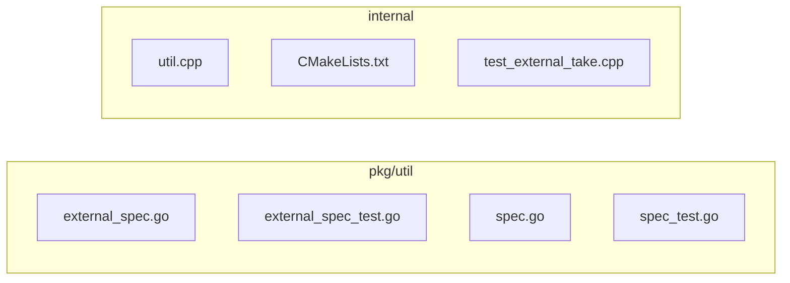

## 🏴‍☠️ Luffy Review — PR #3

**Verdict:** APPROVE  
**Confidence:** high  
**Score:** 92/100  
**Review effort:** 3/5

### Summary
This large PR introduces Azure credential broker support for external tables by extending external table specs to accept additional Azure-specific credentials, validating them in an Azure-only mode, and forward these through the C++ FFI allowlist. It also pins an upstream immutable merge commit from `milvus-storage` containing the broker implementation. The PR includes extensive tests covering new validation and spec handling paths and passes CI. It adds robust validation to reject mixed and malformed credential modes.

### Walkthrough
- Adds `azure_client_id`, `azure_tenant_id`, and `azure_credential_endpoint` fields to external table specs in `external_spec.go` and enforces Azure broker mode validation as an exclusive credential mode, rejecting mixed or malformed modes.
- Pins the `milvus-storage` submodule to an immutable commit with the Azure broker implementation added.
- Extends C++ allowlist and forwarding of the Azure credentials through FFI for external storage integration (`util.cpp` and CMake adjustment).
- Enhances validation in spec utilities to canonicalize and reject bad cases (e.g. noncanonical cloud provider casing, malformed endpoints).
- Adds comprehensive unit tests in Go for new Azure credential validation, spec parsing, canonicalization, and error cases.
- Adds new C++ unit tests for external take related to credential handling.
- Includes integration of Azure-specific fields in external spec parsing and validation ensuring correct required and exclusive fields.
- Retains backward compatibility by enforcing Azure credential mode only for `azure://` URI and exclusive with other credential modes.

### Architecture diagram

### Blocking
- None

### Key findings
None — no high-confidence defects in new code.

### Security audit
No. Credential fields and endpoint URLs are validated stringently with canonicalization, exclusivity enforcement, and malformed input rejection, minimizing risks of injection or misconfiguration. The broker endpoint pattern restricts malformed or arbitrary endpoints. Authorization credentials are never logged. The CI suite includes coverage for invalid cases.

### Multi-lens checklist
| Lens         | Status  | Note                                               |
|--------------|---------|----------------------------------------------------|
| correctness  | ok      | Validation covers required Azure credential cases |
| security     | ok      | Credential fields validated and rejected if invalid or mixed |
| tests        | ok      | Extensive coverage for new spec and validation paths |
| performance  | ok      | No new heavy processing or unbounded loops         |
| api_contracts| ok      | Spec fields added with backward-compatible enforcement |
| concurrency  | n/a     | No concurrent state changes or races visible       |
| maintainability | ok   | Clear segregation of Azure broker logic and validation |

### Suggestions
- Consider adding brief Go struct field comments to new Azure credential fields for clarity in code readers.
- Optionally document rationale for excluding `request_timeout_ms` from external spec model in code comments.

### Code suggestions
None

### Nits
- None

### Tests & risk
- Relevant tests added/updated: yes  
- Coverage: Well-covered validation rules and Azure credential parsing tested in unit tests.  
- Risk: low — changes localized to credential parsing and forwarding with extensive validation logic and unit test coverage.  
- Rollback: easy — revert external spec changes and submodule pin.

### What I checked
- Full diff for all changed files including Go spec files, C++ allowlist patch, CMake submodule update, and tests.  
- Verified validation logic for credential exclusivity and endpoint string.  
- Checked test coverage includes negative and positive Azure credential cases.  
- Confirmed no unsafe global state or concurrency exposed.

---
*Luffy · Hermes Agent · OpenRouter · memory-backed review*
