<!-- luffy-review pr=3 run=local -->
## 🏴‍☠️ Luffy Review — PR #3

**Verdict:** APPROVE  
**Confidence:** high  
**Score:** 95/100  
**Review effort:** 3/5

### Summary
This PR adds support for Azure credential broker in external tables by extending the external specs to accept Azure-specific credentials (`azure_client_id`, `azure_tenant_id`, `azure_credential_endpoint`), validating them as a distinct complete mode, and pinning the corresponding milvus-storage dependency commit with broker implementation. It includes validation for endpoint URLs, cloud provider scheme matching, and mutual exclusivity of credential modes. The PR is well-covered by extensive tests validating correct acceptance, rejection of invalid inputs, and edge cases. The core changes spread through Go external spec parsing/validation, C++ allowlist injection, and test code in both Go and C++.

### Walkthrough
- Adds new Azure credential keys in C++ `kAllowedExtfsSpecKeys` for FFI allowlisted external spec keys (`internal/core/src/storage/loon_ffi/util.cpp`)
- Updates the pinned milvus-storage commit in CMakeLists to include the Azure broker implementation
- Adds a C++ unit test injecting Azure broker credentials and asserting the injected properties (`internal/core/unittest/test_external_take.cpp`)
- Extends Go external spec validation to support Azure broker mode exclusively when scheme and cloud_provider are "azure", requiring all relevant fields including access key and region (`pkg/util/externalspec/external_spec.go`)
- Adds detailed validation error messages if keys are missing, broker endpoint is malformed, or modes are mixed
- Introduces comprehensive Go unit tests that assert success and failure modes for the Azure broker validation logic (`external_spec_test.go`)
- Adds Azure keys to allowed extfs keys maps for parsing in Go external spec utilities (`specutil/spec.go`)
- Adds parsing test for Azure broker keys in extfs (`specutil/spec_test.go`)

### Architecture diagram
<!-- luffy-mermaid -->

_Auto-generated from 7 changed file(s) (F57). Edges between groups are adjacency, not proven runtime dependencies._

```mermaid
flowchart LR
  %% PR changed modules (7 files, 2 groups)
  subgraph g_pkg_util["pkg/util"]
    f_pkg_util_externalspec_external_spec_go["external_spec.go"]
    %% pkg/util/externalspec/external_spec.go
    f_pkg_util_externalspec_external_spec_test_go["external_spec_test.go"]
    %% pkg/util/externalspec/external_spec_test.go
    f_pkg_util_externalspec_specutil_spec_go["spec.go"]
    %% pkg/util/externalspec/specutil/spec.go
    f_pkg_util_externalspec_specutil_spec_test_go["spec_test.go"]
    %% pkg/util/externalspec/specutil/spec_test.go
  end
  subgraph g_internal["internal"]
    f_internal_core_src_storage_loon_ffi_util_cpp["util.cpp"]
    %% internal/core/src/storage/loon_ffi/util.cpp
    f_internal_core_thirdparty_milvus_storage_CMakeLists_txt["CMakeLists.txt"]
    %% internal/core/thirdparty/milvus-storage/CMakeLists.txt
    f_internal_core_unittest_test_external_take_cpp["test_external_take.cpp"]
    %% internal/core/unittest/test_external_take.cpp
  end
  %% group adjacency (not runtime deps)
  g_pkg_util -.-> g_internal
```

Files in diagram

- `internal/core/src/storage/loon_ffi/util.cpp`
- `internal/core/thirdparty/milvus-storage/CMakeLists.txt`
- `internal/core/unittest/test_external_take.cpp`
- `pkg/util/externalspec/external_spec.go`
- `pkg/util/externalspec/external_spec_test.go`
- `pkg/util/externalspec/specutil/spec.go`
- `pkg/util/externalspec/specutil/spec_test.go`

### Blocking
- None

### Key findings
None — no high-confidence defects in new code.

### Security audit
No security concerns found. Validation of Azure broker credentials is strict, including full required key presence checks, rejection of malformed broker endpoints, and strict mutual exclusion from other credential modes.

### Multi-lens checklist
| Lens         | Status  | Note                                                             |
|--------------|---------|------------------------------------------------------------------|
| correctness  | ok      | Clear validation paths and error handling for mode and endpoint |
| security     | ok      | Credential validation and URI checks prevent injection/exploit  |
| tests        | ok      | Extensive tests cover valid and invalid Azure broker specs       |
| performance  | n/a     | No expensive or unbounded loops introduced                       |
| api_contracts| ok      | Backwards compatible with existing extfs spec; new keys added    |
| concurrency  | n/a     | No concurrency primitives involved                               |
| maintainability| ok    | Clean separation and coverage facilitates future changes          |

### Suggestions
- Consider adding doc comments in code on the Azure broker mode fields for easier developer onboarding.

### Code suggestions
None

### Nits
- None

### Tests & risk
- Relevant tests added/updated: yes (Go unit tests for spec validation + C++ tests for property injection)
- Coverage: Very thorough for Azure broker credential paths, failure modes, and boundary conditions
- Risk: low — well-contained feature addition with good validation and test coverage
- Rollback: easy — single commit pin bump and code additions

### What I checked
- Inspecting the diff patch for Go external spec validation and test code additions
- Inspecting C++ allowlist and unittest for Azure broker key injection
- Checking related CMakeLists pin bump and test coverage for secure, robust validation of Azure broker mode

---
*Luffy · Hermes Agent · OpenRouter · memory-backed review*
*Cost / usage: model=`openai/gpt-4.1-mini` · ~$0.02 (estimated) · 149k tokens · 11 API calls*
