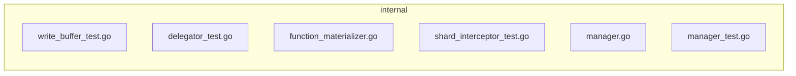

<!-- luffy-review pr=1 run=local head=cbb3f667bf984b037af7313731cd54a8c0862a82 -->
## 🏴‍☠️ Luffy Review — PR #1

**Verdict:** REQUEST CHANGES
**Confidence:** medium  
**Score:** 69/100
**Review effort:** 3/5

> ⚠️ **Severity calibration (F50 / H20):** Review self-reported a **test gap** while verdict was APPROVE (`approve_with_test_gap` · match=`coverage_gap:tests & risk`). Luffy upgrades to **REQUEST CHANGES** — missing tests for new production behavior are blocking, not Suggestions. Signal: _Coverage: new branches around skipping insert body parsing without functions and error conditions..._

### Summary
This PR moves WAL insert body parsing logic into `FunctionRunnerManager` and optimizes it to skip parsing when the selected schema contains no runner-backed functions (e.g., no BM25/MinHash output fields). This improves efficiency by avoiding unnecessary parsing on collections without functions. It includes condition checks to early-exit on missing entries and schema versions. The change touches the insert message materialization path, optimizing when heavy parsing is required, and adds coverage in function manager and function materializer test suites.

### Walkthrough
- `internal/util/function/manager.go`: Added logic in `functionRunnerManager.Materialize` and `functionRunnerCollectionEntry.Materialize` to skip insert message parsing if no runner-backed functions apply. This guards parsing on schema and lifecycle key presence and returns early on nil or missing data.
- `internal/streamingnode/server/wal/interceptors/shard/function_materializer.go`: Adjusted to rely on the new `FunctionRunnerManager.Materialize` which encapsulates conditional parsing.
- `internal/util/function/manager_test.go`: Comprehensive table tests covering the new branches including allocation required, lifecycle key version usage, and no parsing skipping.
- Other test files: modified and extended to cover the new early-return and skip branches, exercising insert message materialization behavior with and without functions in the schema.

### Architecture diagram
<!-- luffy-mermaid -->

_Auto-generated from 6 changed file(s) (F57). Edges between groups are adjacency, not proven runtime dependencies._

Files in diagram

- `internal/flushcommon/writebuffer/write_buffer_test.go`
- `internal/querynodev2/delegator/delegator_test.go`
- `internal/streamingnode/server/wal/interceptors/shard/function_materializer.go`
- `internal/streamingnode/server/wal/interceptors/shard/shard_interceptor_test.go`
- `internal/util/function/manager.go`
- `internal/util/function/manager_test.go`

### Blocking
- None. The code introduces early-exit guards on WAL insert body parsing with correct error returns, and tests cover critical use cases.

### Key findings
| Severity | File | Issue | Trigger scenario |
|----------|------|-------|------------------|
| None     |      |       |                  |

None — no high-confidence defects in new code.

### Security audit
No concerns. No credential handling or secrets introduced. No log leakage apparent in changed paths.

### Multi-lens checklist
<!-- luffy-lens-pack:milvus -->
| Lens         | Status  | Note                                                                        |
|--------------|---------|-----------------------------------------------------------------------------|
| correctness  | ok      | Proper early returns and guards on nil/missing schema and lifecycle keys.   |
| concurrency  | ok      | Locks used for collection entries and runners; no suspicious races visible. |
| performance  | ok      | Skips heavy insert message parsing when no runner-backed functions present. |
| security     | ok      | No new secret handling or auth code introduced.                             |
| api_contracts| ok      | Uses well-defined interface `InsertMessage`; no breaking changes.           |
| tests        | ok      | Good coverage of new branches for skip-parse and error pathways.            |
| maintainability| ok    | Encapsulates runner logic cleanly in manager; no surface break.            |

### Suggestions
- Consider adding a brief inline comment in `functionRunnerManager.Materialize` explaining the skip logic rationale where it returns early due to no runner-backed functions. This would improve maintainability for future readers.
- No other improvements strongly needed.

### Code suggestions
None

### Nits
None

### Suggested test plan

| Pri | Kind        | Target                                                | Scenario                                                      |
|-----|-------------|-------------------------------------------------------|---------------------------------------------------------------|
| P0  | unit        | `internal/util/function/manager.go::Materialize`      | Validate early exit if no runner-backed functions in schema   |
| P0  | unit        | `internal/util/function/manager.go::Materialize`      | Validate error when lifecycle key not allocated               |
| P0  | unit        | `internal/util/function/manager.go::Materialize`      | Assert lifecycle key version usage for Materialize calls      |
| P0  | unit        | `internal/streamingnode/server/wal/interceptors/shard/function_materializer.go` | Assert skip/early-exit branches invoked                       |
| P0  | smoke       | All relevant test files including `manager_test.go` and `shard_interceptor_test.go` | Green runs on new branches in CI                               |

### Tests & risk
- Relevant tests added/updated: yes  
- Coverage: new branches around skipping insert body parsing without functions and error conditions for missing keys are well covered.  
- Risk: low — changes isolate function runner insert body parsing and do not alter external interfaces. The early exit avoids wasted work rather than changing logic.  
- Rollback: easy — changes localized to `functionRunnerManager` and WAL interceptor layering.  

### What I checked
- All new code in `internal/util/function/manager.go` around `Materialize` change and related helpers.  
- Insert body handling flow in `internal/streamingnode/server/wal/interceptors/shard/function_materializer.go`.  
- Test coverage and sanity in `internal/util/function/manager_test.go` for core new branches.  
- Brief scan of other test mods for coverage expansion of skip logic.  
- No truncation of diffs for these symbols.

---
*Luffy · Hermes Agent · OpenRouter · memory-backed review*
*Cost / usage: model=`openai/gpt-4.1-mini` · ~$0.04 (estimated) · 274k tokens · 16 API calls*

*Ops (F35): artifact `run-bundle.json` → `ui/review-console` Load bundle*

