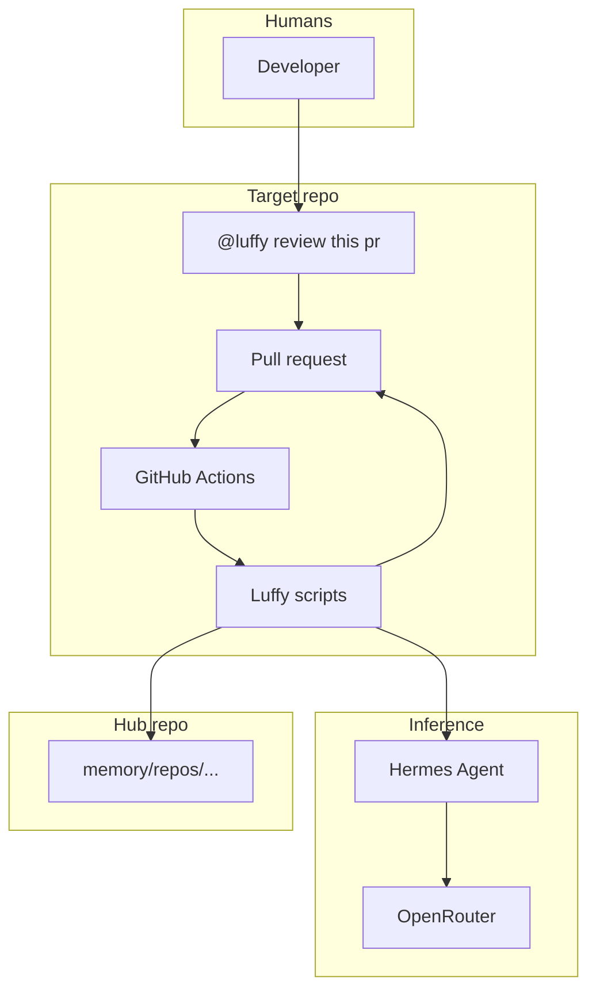
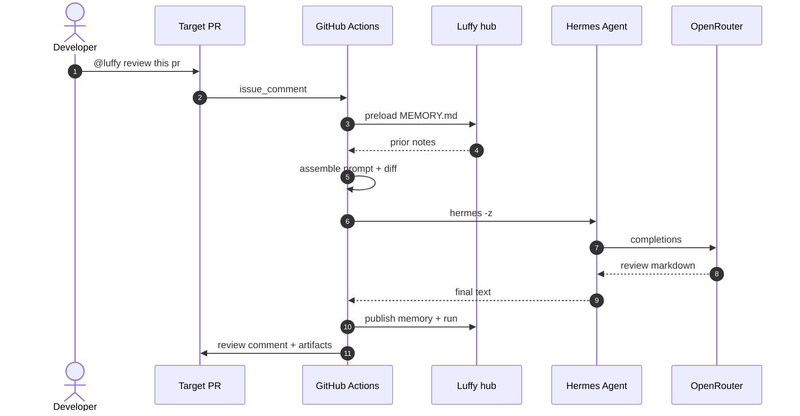
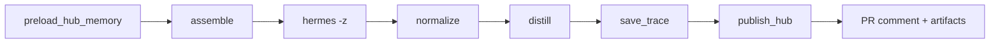
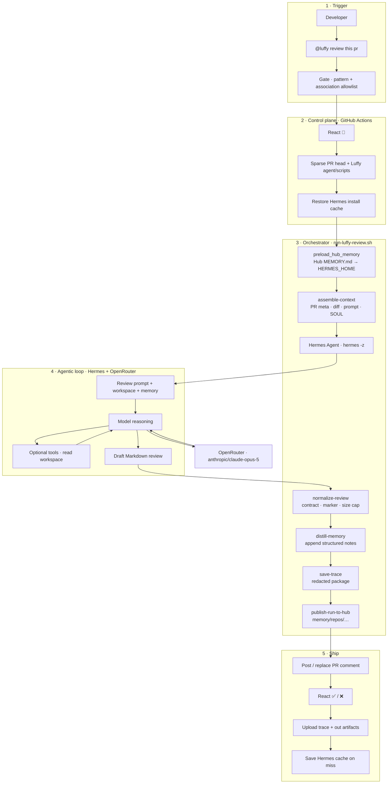

<p align="center">
  
</p>

<h1 align="center">Luffy</h1>

<p align="center"><strong>Comment-triggered PR review agent</strong></p>

<p align="center">Hermes Agent + OpenRouter + growing hub memory + redacted run traces.</p>

[](https://github.com/Mr-Ashish/luffy-pr-review-agent/actions/workflows/luffy-pr-review.yml)
[](https://github.com/Mr-Ashish/luffy-pr-review-agent/actions/workflows/ingest-luffy-run.yml)


[](https://github.com/Mr-Ashish/luffy-pr-review-agent/commits/main)


## Why it exists

Most AI PR bots are stateless chat on a diff. Luffy is a review control plane: explicit trigger, bounded context (sparse checkout + capped diff), Hermes via OpenRouter, durable hub memory so the next review on the same repo is smarter, and redacted traces as Actions artifacts for audit.

## Trigger

```text
@luffy review this pr
@luffy review
```

Also: **Actions → Luffy PR Review → Run workflow** (PR number).

## High-level architecture



Install Luffy on each **target** repo; this hub stores memory under `memory/repos/`.

## E2E flow



**Pipeline stages**



## Agentic loop (example)

End-to-end control plane for one review: comment trigger → Actions gate → orchestrator stages → Hermes multi-turn agentic loop (tools + OpenRouter · Claude Opus 5) → normalize → memory + full step trace → PR comment. Live package: docs/showcase/e2e-odoo-pr3-opus5-agentic-loop/.

**ASCII (high level)**

```text
@luffy review this pr
        │
        ▼
┌───────────────────────────────────────────────────────────────┐
│  GitHub Actions · luffy-pr-review.yml                         │
│  gate (pattern + association) → 👀 → sparse checkout → cache  │
└────────────────────────────┬──────────────────────────────────┘
                             │
                             ▼
┌───────────────────────────────────────────────────────────────┐
│  Orchestrator · scripts/run-luffy-review.sh                   │
│                                                               │
│   1 preload_hub_memory ──► Hub MEMORY.md → HERMES_HOME        │
│   2 assemble-context   ──► PR meta + diff + prompt + SOUL     │
│   3 hermes -z  ───────────────────────────────────────────┐   │
│        │                                                  │   │
│        │    ┌─ agentic loop (Hermes + OpenRouter) ──────┐ │   │
│        │    │  prompt + memory + workspace               │ │   │
│        │    │       │                                   │ │   │
│        │    │       ▼                                   │ │   │
│        │    │  model reasoning ◄──► tools (read files)  │ │   │
│        │    │       │                                   │ │   │
│        │    │       ▼                                   │ │   │
│        │    │  draft Markdown review                    │ │   │
│        │    └───────────────────────────────────────────┘ │   │
│        ▼                                                  │   │
│   4 normalize-review   ──► contract · marker · cap        │   │
│   5 distill-memory     ──► append notes to MEMORY.md      │   │
│   6 save-trace         ──► redacted .luffy-out/traces/    │   │
│   7 publish-run-to-hub ──► memory/repos/{owner}--{repo}/  │   │
└────────────────────────────┬──────────────────────────────────┘
                             │
                             ▼
┌───────────────────────────────────────────────────────────────┐
│  Ship · PR comment (replace prior) · ✅/❌ · artifacts · cache│
└───────────────────────────────────────────────────────────────┘
```

**Mermaid (full control plane + model loop)**



Inner loop: Hermes may call tools (read workspace files) before emitting the final Markdown review. Outer loop is deterministic shell orchestration so every run leaves a redacted trace under `.luffy-out/traces/` and hub memory under `memory/repos/`.

## E2E showcase (live · Opus 5)

Full agentic-loop capture on [odoo/odoo#271153](https://github.com/odoo/odoo/issues/271153) → [Mr-Ashish/odoo#3](https://github.com/Mr-Ashish/odoo/pull/3), model **anthropic/claude-opus-5**.

| | |
|--|--|
| **Actions** | [30574256524](https://github.com/Mr-Ashish/odoo/actions/runs/30574256524) |
| **Verdict** | REQUEST CHANGES · **Score** 42/100 · effort 4/5 |
| **Hermes** | ~251s · **10 API calls** · 9 tool-call turns · 26 messages |
| **Tokens** | ~195k total (cache-heavy) · est. **$0.59** |
| **Trace** | [`docs/showcase/e2e-odoo-pr3-opus5-agentic-loop/`](docs/showcase/e2e-odoo-pr3-opus5-agentic-loop/) |

Package includes **prompts, every tool call, session messages, usage JSON, agent.log**, plus the final review. Start here:

- [`agent-loop/agent-loop.md`](docs/showcase/e2e-odoo-pr3-opus5-agentic-loop/agent-loop/agent-loop.md) — step-by-step loop
- [`agent-loop/agent-loop.json`](docs/showcase/e2e-odoo-pr3-opus5-agentic-loop/agent-loop/agent-loop.json) — machine-readable messages + tools
- [`review.md`](docs/showcase/e2e-odoo-pr3-opus5-agentic-loop/review.md) — posted PR comment
- [`hermes-usage.json`](docs/showcase/e2e-odoo-pr3-opus5-agentic-loop/hermes-usage.json) — tokens / cost / session_id

```bash
gh run download 30574256524 -R Mr-Ashish/odoo -n luffy-trace-pr3-run30574256524
```

## Setup (target repo)

1. Copy `agent/`, `scripts/`, and `.github/workflows/luffy-pr-review.yml` onto the **default branch**
2. Add secret `OPENROUTER_API_KEY`
3. Add secret `LUFFY_HUB_TOKEN` (PAT that can push to this hub)
4. Optional vars: `LUFFY_MODEL`, `LUFFY_HUB_REPO`, `LUFFY_HUB_MODE`
5. Comment on a PR: `@luffy review this pr`

## Local dry-run

```bash
# .env has OPENROUTER_API_KEY (gitignored)
./scripts/review-local.sh owner/repo 123
POST_COMMENT=1 ./scripts/review-local.sh owner/repo 123
```

## Traces

Each run packages a redacted trace and uploads Actions artifacts.

```text
.luffy-out/traces/pr{N}-run{id}-a{attempt}/
  meta.json  prompt.md  context.md  pr.diff
  review.raw.md  review.md  hermes.stderr  timings.json
```

```bash
gh run download <run-id> -R owner/repo -n luffy-trace-pr1-run<run-id>
```

## Central hub memory

After each run, the target publishes into **this** hub repo so memory grows across reviews.

```text
memory/repos/{owner}--{repo}/
  MEMORY.md
  latest.json
  runs/{trace_id}/meta.json|review.md|summary.md
```

## Layout

```text
agent/          SOUL, prompts, Hermes config
scripts/        assemble → hermes → normalize → hub
memory/         central per-repo MEMORY (hub)
readme-kit/     compile README from theme + pack + config
assets/         brand mark + favicon
.github/workflows/
```

## Docs

- [Architecture](docs/ARCHITECTURE.md)
- [Operations](docs/OPERATIONS.md)
- [ROI fixes](docs/ROI-FIXES.md)
- [README branding ecosystem](docs/README-BRANDING-ECOSYSTEM.md)
- [readme-kit MVP](docs/README-KIT-MVP.md)

## Limits (v1)

- PR comment reviews only (not inline threads yet)
- Diffs truncated at MAX_DIFF_BYTES
- Default OpenRouter model is paid (anthropic/claude-opus-5; override with LUFFY_MODEL)
- Install on each target repo — not a global bot for arbitrary public repos
- Hermes tool-loop traces not fully exported yet (final review + outer pipeline are)

---

*Luffy · Hermes Agent · OpenRouter · memory-backed review · generated by readme-kit*

