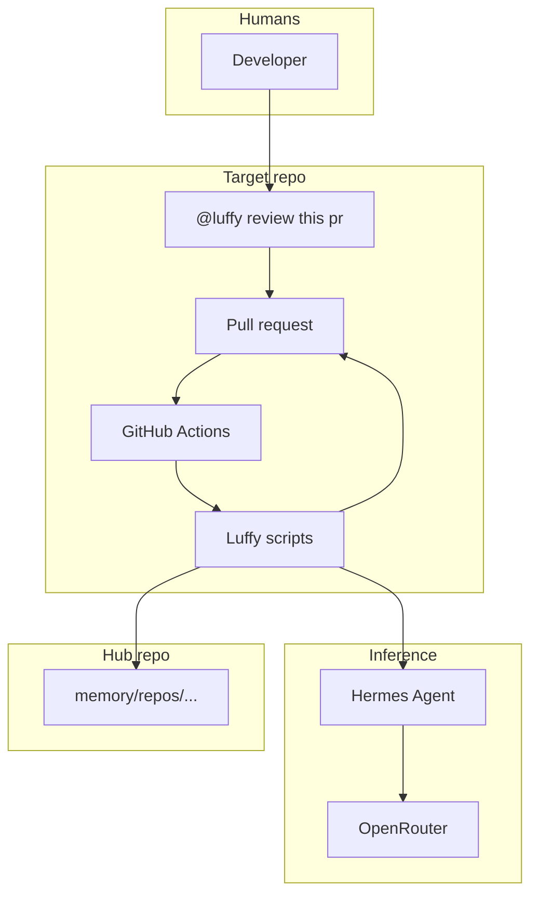
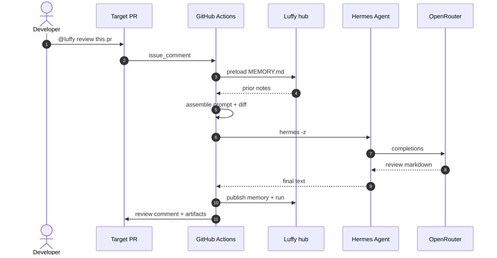
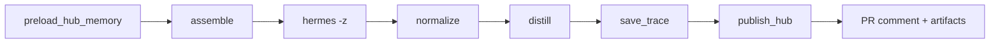

<p align="center">
  
</p>

# Luffy

**Comment-triggered PR review agent**

Hermes Agent + OpenRouter + growing hub memory + redacted run traces.

[](https://github.com/Mr-Ashish/luffy-pr-review-agent/actions/workflows/luffy-pr-review.yml)
[](https://github.com/Mr-Ashish/luffy-pr-review-agent/actions/workflows/ingest-luffy-run.yml)


[](https://github.com/Mr-Ashish/luffy-pr-review-agent/commits/main)


## Why it exists

Most AI PR bots are stateless chat on a diff. Luffy is a review control plane: explicit trigger, bounded context (sparse checkout + capped diff), Hermes via OpenRouter, durable hub memory so the next review on the same repo is smarter, and redacted traces as Actions artifacts for audit.

## Trigger

```text
@luffy review this pr
@luffy review
```

Also: **Actions → Luffy PR Review → Run workflow** (PR number).

## High-level architecture



Install Luffy on each **target** repo; this hub stores memory under `memory/repos/`.

## E2E flow



**Pipeline stages**



## Setup (target repo)

1. Copy `agent/`, `scripts/`, and `.github/workflows/luffy-pr-review.yml` onto the **default branch**
2. Add secret `OPENROUTER_API_KEY`
3. Add secret `LUFFY_HUB_TOKEN` (PAT that can push to this hub)
4. Optional vars: `LUFFY_MODEL`, `LUFFY_HUB_REPO`, `LUFFY_HUB_MODE`
5. Comment on a PR: `@luffy review this pr`

## Local dry-run

```bash
# .env has OPENROUTER_API_KEY (gitignored)
./scripts/review-local.sh owner/repo 123
POST_COMMENT=1 ./scripts/review-local.sh owner/repo 123
```

## Traces

Each run packages a redacted trace and uploads Actions artifacts.

```text
.luffy-out/traces/pr{N}-run{id}-a{attempt}/
  meta.json  prompt.md  context.md  pr.diff
  review.raw.md  review.md  hermes.stderr  timings.json
```

```bash
gh run download <run-id> -R owner/repo -n luffy-trace-pr1-run<run-id>
```

## Central hub memory

After each run, the target publishes into **this** hub repo so memory grows across reviews.

```text
memory/repos/{owner}--{repo}/
  MEMORY.md
  latest.json
  runs/{trace_id}/meta.json|review.md|summary.md
```

## Layout

```text
agent/          SOUL, prompts, Hermes config
scripts/        assemble → hermes → normalize → hub
memory/         central per-repo MEMORY (hub)
readme-kit/     compile README from theme + pack + config
assets/         brand mark + favicon
.github/workflows/
```

## Docs

- [Architecture](docs/ARCHITECTURE.md)
- [Operations](docs/OPERATIONS.md)
- [ROI fixes](docs/ROI-FIXES.md)
- [README branding ecosystem](docs/README-BRANDING-ECOSYSTEM.md)
- [readme-kit MVP](docs/README-KIT-MVP.md)

## Limits (v1)

- PR comment reviews only (not inline threads yet)
- Diffs truncated at MAX_DIFF_BYTES
- Default OpenRouter model is paid (openai/gpt-5-mini)
- Install on each target repo — not a global bot for arbitrary public repos
- Hermes tool-loop traces not fully exported yet (final review + outer pipeline are)

---

*Luffy · Hermes Agent · OpenRouter · memory-backed review · generated by readme-kit*

