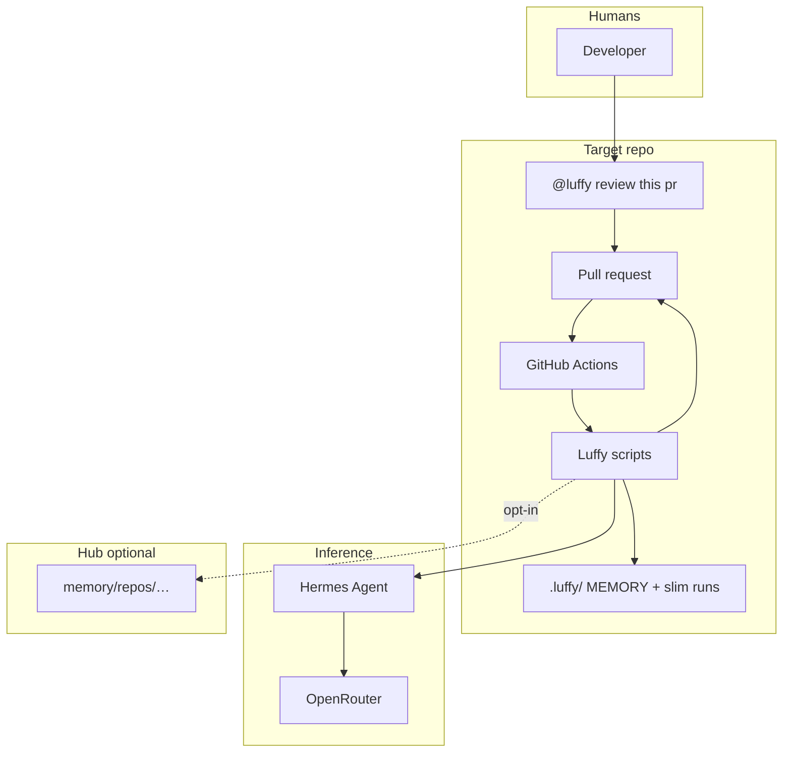
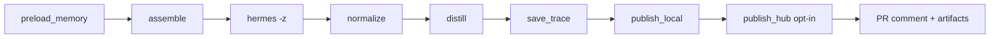
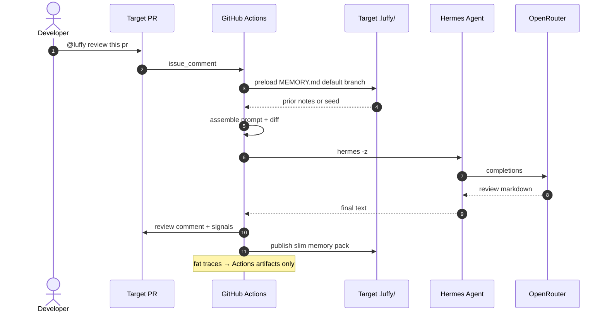
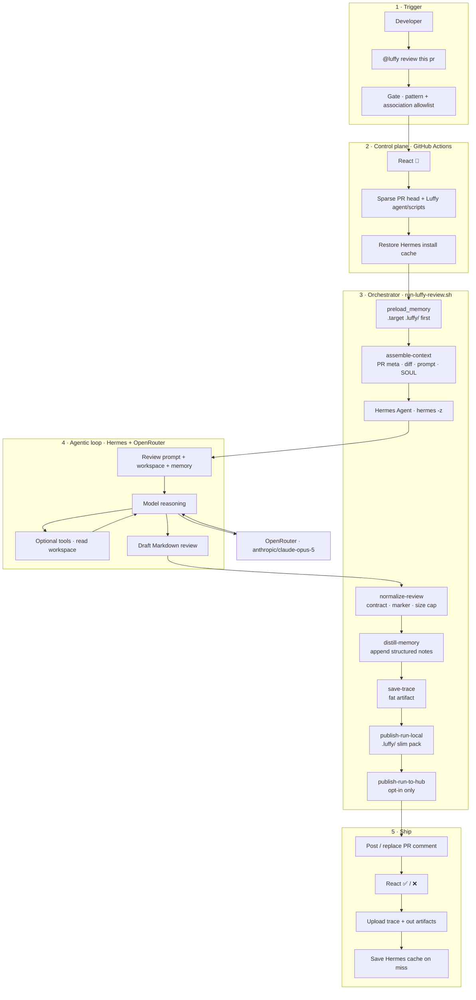
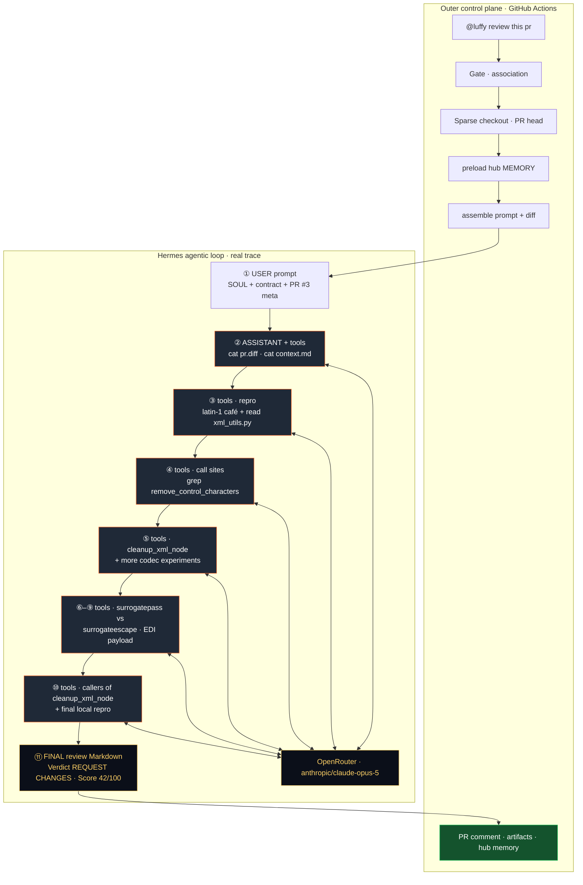

<p align="center">
  
</p>

<h1 align="center">Luffy</h1>

<p align="center"><strong>Comment-triggered PR review agent</strong></p>

<p align="center">Hermes Agent + OpenRouter + repo-local <code>.luffy/</code> memory + redacted run traces.</p>

[](https://github.com/Mr-Ashish/luffy-pr-review-agent/actions/workflows/luffy-pr-review.yml)
[](docs/ARCHITECTURE.md)


[](https://github.com/Mr-Ashish/luffy-pr-review-agent/commits/main)


## Why it exists

Most AI PR bots are stateless chat on a diff. Luffy is a review control plane: explicit trigger, bounded context (sparse checkout + capped diff), Hermes via OpenRouter, **durable memory in the target repo under `.luffy/`** (hub is optional), and redacted fat traces as Actions artifacts for audit.

## Trigger

```text
@luffy review this pr
@luffy review
```

Also: **Actions → Luffy PR Review → Run workflow** (PR number).

## High-level architecture

Install Luffy on each **target** repo. **Default memory is repo-local** (`.luffy/` on the target default branch). Central hub ingest is **opt-in** (`LUFFY_MEMORY_MODE=hub|both` or `LUFFY_HUB_PUBLISH=1`).

### Component-level architecture (ASCII)

```text
┌─────────────────────────────────────────────────────────────────────────────┐
│                              HUMANS / OPS                                   │
│  Developer ──@luffy review──► PR comment   │   Ops ──Load bundle──► Console │
└──────────────────────┬──────────────────────┴──────────────▲────────────────┘
                       │                                     │
                       ▼                                     │
┌─────────────────────────────────────────────────────────────────────────────┐
│                         TARGET REPO (per install)                           │
│  ┌──────────────┐  ┌────────────────────┐  ┌─────────────────────────────┐  │
│  │ Pull Request │  │ Thin GHA caller    │  │ .luffy/  (repo-local mem)   │  │
│  │ + comments   │  │ luffy-pr-review.yml│  │  MEMORY.md                  │  │
│  │ + labels     │  │ (or pack + scripts)│  │  runs/{trace_id}/slim       │  │
│  └──────┬───────┘  └─────────┬──────────┘  └──────────────▲──────────────┘  │
│         │                    │                            │                 │
└─────────┼────────────────────┼────────────────────────────┼─────────────────┘
          │ issue_comment /    │ workflow_call              │ publish_local
          │ workflow_dispatch  ▼                            │
┌─────────┼─────────────────────────────────────────────────┼─────────────────┐
│         │         CONTROL PLANE (hub reusable / pack)     │                 │
│         ▼                                                 │                 │
│  ┌──────────────────────────────────────────────────────────────────────┐   │
│  │  GitHub Actions · luffy-review-reusable.yml                          │   │
│  │  gate (pattern · association · cooldown · concurrency)               │   │
│  │  path-skip (F38) · sparse checkout · dual workspace · cache          │   │
│  └───────────────────────────────┬──────────────────────────────────────┘   │
│                                  │                                          │
│  ┌───────────────────────────────▼──────────────────────────────────────┐   │
│  │  Orchestrator · scripts/run-luffy-review.sh                          │   │
│  │                                                                      │   │
│  │  ┌─────────────┐ ┌──────────────┐ ┌─────────────┐ ┌───────────────┐  │   │
│  │  │ preload     │ │ assemble-    │ │ hermes      │ │ normalize +   │  │   │
│  │  │ memory      │ │ context.sh   │ │ review      │ │ usage footer  │  │   │
│  │  └──────┬──────┘ └──────┬───────┘ └──────┬──────┘ └───────┬───────┘  │   │
│  │         │               │                │                │          │   │
│  │  ┌──────▼──────┐ ┌──────▼───────┐ ┌──────▼──────┐ ┌───────▼───────┐  │   │
│  │  │ distill +   │ │ save-trace   │ │ publish     │ │ verdict ship  │  │   │
│  │  │ fp_resolve  │ │ (fat, art.)  │ │ local|hub   │ │ post · labels │  │   │
│  │  └─────────────┘ └──────────────┘ └─────────────┘ │ inline · status│  │   │
│  │                                                   └───────────────┘  │   │
│  └───────────────────────────────┬──────────────────────────────────────┘   │
│                                  │                                          │
│  Dual workspace (job FS)         │           Optional hosts                 │
│  ┌──────────┐ ┌───────────┐      │    ┌──────────────────────────────────┐  │
│  │ luffy/   │ │ workspace/│      │    │ Modal · modal_app.review_pr     │  │
│  │ agent +  │ │ PR head   │      │    │ (same orchestrator; parity)     │  │
│  │ scripts  │ │ (code)    │      │    │ Webhook/enqueue only spawns job │  │
│  └──────────┘ └───────────┘      │    └──────────────────────────────────┘  │
│  ┌──────────────────────┐        │                                          │
│  │ .luffy-hermes-home/  │        │    Agent config surface                  │
│  │ HERMES + MEMORY L0   │        │    agent/SOUL · packs · tools · skills   │
│  └──────────────────────┘        │                                          │
└──────────────────────────────────┼──────────────────────────────────────────┘
                                   │
          ┌────────────────────────┼────────────────────────┐
          ▼                        ▼                        ▼
┌──────────────────┐    ┌──────────────────┐    ┌──────────────────────────┐
│ Hermes Agent     │───►│ OpenRouter       │    │ Optional Hub memory      │
│ (agentic loop)   │◄───│ Claude / models  │    │ memory/repos/{slug}/     │
│ tools: read files│    │ completions      │    │ (LUFFY_MEMORY_MODE=hub|  │
│ in workspace/    │    └──────────────────┘    │  both or HUB_PUBLISH=1)  │
└──────────────────┘                            └──────────────────────────┘
          │
          ▼
┌─────────────────────────────────────────────────────────────────────────────┐
│  Outputs                                                                    │
│  · PR comment (replace prior <!-- luffy-review -->)                         │
│  · Commit status luffy/review · reaction · labels · inline suggestions      │
│  · Actions artifacts (fat traces) · run-bundle.json → ui/review-console     │
└─────────────────────────────────────────────────────────────────────────────┘
```

### Component map

| Layer | Components | Role |
|-------|------------|------|
| **Trigger** | PR comment / `workflow_dispatch` / console Run tab / Modal webhook | Start a review |
| **Gate** | Reusable workflow + association/cooldown/path-skip | Cheap reject / skip |
| **Runtime FS** | `luffy/` · `workspace/` · `.luffy-hermes-home/` · `.luffy-out/` | Agent vs code vs session vs outputs |
| **Orchestrator** | `run-luffy-review.sh` + stage scripts | Ordered pipeline, timings |
| **Agent** | Hermes + SOUL/packs/tools | Multi-turn review over bounded context |
| **Inference** | OpenRouter | Model API |
| **Memory** | Target `.luffy/` (default) · hub (opt-in) · artifacts (fat) | L1 durable / L3 hub / L2 audit |
| **Ship** | post comment · verdict · inline · labels · status | Visible PR surface |
| **Ops UI** | `pack-run-for-ui` → `ui/review-console` | Full-run inspection |

### Mermaid (compact)



## E2E flow

### End-to-end (ASCII)

```text
 Developer
    │
    │  1. "@luffy review this pr"  (or Actions Run workflow / Modal enqueue)
    ▼
┌──────────────────── Target PR ────────────────────┐
│  issue_comment created                             │
└────────────────────┬───────────────────────────────┘
                     │
                     ▼
┌──────────────── GitHub Actions ───────────────────┐
│  2. Pattern match + association + concurrency      │
│  3. Cooldown check                                 │
│  4. 👀 reaction                                    │
│  5. Sparse path list → optional path-glob skip     │
│  6. Dual checkout: luffy/ + workspace/ (PR head)    │
│  7. Hermes home cache                              │
└────────────────────┬───────────────────────────────┘
                     │
                     ▼
┌────────── Orchestrator run-luffy-review.sh ───────┐
│                                                    │
│  8. preload_memory                                 │
│       · default: target .luffy/MEMORY.md (API)     │
│       · opt-in hub seed                            │
│       · → HERMES_HOME/memories/MEMORY.md           │
│                     │                              │
│  9. assemble-context                               │
│       · gh pr meta + capped diff + prompt + SOUL   │
│       · no LLM                                     │
│                     │                              │
│ 10. hermes -z  (+ F36 wall-clock timeout)          │
│       ┌─────────────────────────────────────┐      │
│       │  Agentic loop                       │      │
│       │  prompt + memory + workspace         │      │
│       │       │                             │      │
│       │       ▼                             │      │
│       │  model (OpenRouter) ◄──► tools      │      │
│       │  (read files, deepen on hunks)      │      │
│       │       │                             │      │
│       │       ▼                             │      │
│       │  draft Markdown review              │      │
│       └─────────────────────────────────────┘      │
│                     │                              │
│ 11. normalize-review                               │
│       · contract · marker · size · redact secrets  │
│ 12. usage-summary (cost/tokens footer)             │
│ 13. distill-memory + fp_resolve update             │
│ 14. save-trace → fat package (artifact only)       │
│ 15. publish_local → target .luffy/ slim pack       │
│ 16. publish_hub → opt-in only                      │
│ 17. pack_ui_bundle → run-bundle.json               │
└────────────────────┬───────────────────────────────┘
                     │
                     ▼
┌──────────────────── Ship ─────────────────────────┐
│ 18. Post PR comment (delete prior Luffy markers)   │
│ 19. Verdict: reaction · commit status · labels     │
│ 20. Inline comments + suggestion blocks (if any)   │
│ 21. Upload Actions artifacts · job summary         │
│ 22. Memory health env (local/hub publish signals)  │
└────────────────────┬───────────────────────────────┘
                     │
          ┌──────────┴──────────┐
          ▼                     ▼
   Developer sees          Ops loads
   PR review comment       run-bundle in
   + checks/labels         Review Console
```

### Pipeline stage chain

```text
preload_memory → assemble → hermes → normalize → distill
      → save_trace → publish_local → publish_hub? → post + verdict signals
```



### Memory layers

```text
L0  .luffy-hermes-home/          single-run Hermes session
L1  target .luffy/MEMORY.md      default durable SoT (committed)
L2  Actions artifacts            fat traces (not git)
L3  hub memory/repos/{slug}/     opt-in federation
         ▲
         └── distill after each review, then publish_local
```

### Alternate hosts (same kitchen)

```text
GHA reusable ──┐
Modal review_pr├──► run-luffy-review.sh ──► Hermes ──► OpenRouter
Local CLI ─────┘         (parity helper: modal_parity.py)
```

### Mermaid sequence



## Agentic loop (example)

End-to-end control plane for one review: comment trigger → Actions gate → orchestrator stages → Hermes multi-turn agentic loop (tools + OpenRouter · Claude Opus 5) → normalize → memory + full step trace → PR comment. Live package: docs/showcase/e2e-odoo-pr3-opus5-agentic-loop/.

**ASCII (orchestrator + inner loop)**

```text
@luffy review this pr
        │
        ▼
┌───────────────────────────────────────────────────────────────┐
│  GitHub Actions · luffy-pr-review.yml                         │
│  gate (pattern + association) → 👀 → sparse checkout → cache  │
└────────────────────────────┬──────────────────────────────────┘
                             │
                             ▼
┌───────────────────────────────────────────────────────────────┐
│  Orchestrator · scripts/run-luffy-review.sh                   │
│                                                               │
│   1 preload_memory     ──► .luffy/MEMORY.md → HERMES_HOME     │
│   2 assemble-context   ──► PR meta + diff + prompt + SOUL     │
│   3 hermes -z  ───────────────────────────────────────────┐   │
│        │                                                  │   │
│        │    ┌─ agentic loop (Hermes + OpenRouter) ──────┐ │   │
│        │    │  prompt + memory + workspace               │ │   │
│        │    │       │                                   │ │   │
│        │    │       ▼                                   │ │   │
│        │    │  model reasoning ◄──► tools (read files)  │ │   │
│        │    │       │                                   │ │   │
│        │    │       ▼                                   │ │   │
│        │    │  draft Markdown review                    │ │   │
│        │    └───────────────────────────────────────────┘ │   │
│        ▼                                                  │   │
│   4 normalize-review   ──► contract · marker · cap        │   │
│   5 distill-memory     ──► append notes (job-local)       │   │
│   6 save-trace         ──► fat artifact (not git)         │   │
│   7 publish-run-local  ──► target .luffy/ slim pack       │   │
│   8 publish-run-to-hub ──► opt-in hub memory/repos/…      │   │
└────────────────────────────┬──────────────────────────────────┘
                             │
                             ▼
┌───────────────────────────────────────────────────────────────┐
│  Ship · PR comment (replace prior) · ✅/❌ · artifacts · cache│
└───────────────────────────────────────────────────────────────┘
```

**Mermaid (full control plane + model loop)**



Inner loop: Hermes may call tools (read workspace files) before emitting the final Markdown review. Outer loop is deterministic shell orchestration so every run leaves a redacted fat trace under `.luffy-out/traces/` (artifact) and a **slim** durable pack under the target’s **`.luffy/`** (git). Hub `memory/repos/…` is opt-in.

**One-liner:** Luffy is a gated control plane (GHA/Modal) that bounds PR context, runs Hermes+OpenRouter with repo-local `.luffy/` memory, normalizes the review contract, ships PR signals, and keeps fat traces out of git.

## E2E showcase (live · Opus 5 agentic loop)

Full captured run on [odoo/odoo#271153](https://github.com/odoo/odoo/issues/271153) → [Mr-Ashish/odoo#3](https://github.com/Mr-Ashish/odoo/pull/3).

| | |
|--|--|
| **Actions** | [30574256524](https://github.com/Mr-Ashish/odoo/actions/runs/30574256524) |
| **Session** | `20260730_191954_63f003` |
| **Model** | `anthropic/claude-opus-5` via OpenRouter |
| **Loop** | **10 API calls** · **9 tool-call turns** · **26 messages** · ~251s Hermes |
| **Tokens** | ~195k total (cache-heavy) · est. **$0.59** |
| **Verdict** | REQUEST CHANGES · **Score** 42/100 · effort 4/5 |
| **Package** | [`docs/showcase/e2e-odoo-pr3-opus5-agentic-loop/`](docs/showcase/e2e-odoo-pr3-opus5-agentic-loop/) |

### High-level e2e agentic loop (this trace)

Mermaid below is **not a sketch** — nodes match the live session: outer Actions control plane, then Hermes multi-turn tool loop (read diff → codec repros → call-site grep → surrogatepass vs surrogateescape → final review).



**What the agent actually did (condensed from the trace)**

| Turn | Kind | What happened |
|------|------|----------------|
| 1 | user | Full Luffy review prompt + PR #3 meta |
| 2 | tools | `cat pr.diff`, `cat context.md` |
| 3 | tools | Latin-1 `café` repro + read `xml_utils.py` |
| 4 | tools | `grep remove_control_characters` call sites |
| 5–8 | tools | More codec / `cleanup_xml_node` experiments |
| 9 | tools | Callers of `cleanup_xml_node` + final repro |
| 10 | assistant | Structured review → REQUEST CHANGES (surrogatepass bug) |

Full step dump (every tool arg + message): [`agent-loop/agent-loop.md`](docs/showcase/e2e-odoo-pr3-opus5-agentic-loop/agent-loop/agent-loop.md) · JSON: [`agent-loop/agent-loop.json`](docs/showcase/e2e-odoo-pr3-opus5-agentic-loop/agent-loop/agent-loop.json)

```bash
gh run download 30574256524 -R Mr-Ashish/odoo -n luffy-trace-pr3-run30574256524
```

## ASCII diagram index

All **text** diagrams in this README (mermaid charts are separate, above):

| # | Diagram | Section |
|---|---------|---------|
| A1 | Full control plane (Actions → orchestrator → ship) | [Agentic loop (example)](#agentic-loop-example) |
| A2 | Hermes-only high-level (prompt → loop → review) | [Hermes agentic loop only](#hermes-agentic-loop-only) |
| A3 | Hermes loop step-by-step (LLM ↔ tools ↔ done) | [Hermes agentic loop only](#hermes-agentic-loop-only) |
| A4 | Message / data flow inside one Hermes run | [Hermes agentic loop only](#hermes-agentic-loop-only) |
| A5 | Optional F49 zero-tool re-prompt second loop | [Hermes agentic loop only](#hermes-agentic-loop-only) |
| A6 | After Hermes exits (normalize · capture · usage) | [Hermes agentic loop only](#hermes-agentic-loop-only) |
| A7 | Modal batch traces map (top-10 milvus corpus) | [Modal DeepSeek V4 Pro traces](#modal-deepseek-v4-pro-traces--milvus-top-10) |

---

## Hermes agentic loop only

What runs **inside** `hermes -z` once the prompt is already assembled (not the outer Actions/Modal kitchen). Live Modal batch evidence: milvus fork PRs with `deepseek/deepseek-v4-pro` (e.g. #6 → **63 messages · 24 tool turns**).

### A2 — High-level

```text
                    prompt.md
            (review contract + diff + skills)
                         |
                         v
              ┌─────────────────────┐
              │   hermes -z         │
              │   OpenRouter model  │  e.g. deepseek/deepseek-v4-pro
              │   toolsets=terminal │
              │   max_turns ≤ 40    │
              └──────────┬──────────┘
                         |
         ┌───────────────┴───────────────┐
         │     AGENTIC LOOP              │
         │  (repeat until final text)    │
         └───────────────┬───────────────┘
                         |
         ┌───────────────┼───────────────┐
         v               v               v
   LLM think/       tool call(s)    final review
   plan next        terminal on      Markdown
   action           workspace        → stdout
         |               |               |
         |               v               v
         |        tool result      review-N.raw.md
         |        back into        (+ hermes-usage.json)
         |        messages
         └─────── loop ──────────────┘
```

### A3 — Step-by-step

```text
                         ┌──────────────┐
                         │  START       │
                         │  load prompt │
                         │  + SOUL/cfg  │
                         └──────┬───────┘
                                v
                    ┌───────────────────────┐
              ┌────►│  LLM turn             │◄────────────────┐
              │     │  model completes with │                 │
              │     │  either:              │                 │
              │     │   A) tool_calls[]     │                 │
              │     │   B) final text       │                 │
              │     └───────────┬───────────┘                 │
              │                 │                             │
              │       ┌─────────┴─────────┐                   │
              │       v                   v                   │
              │  [A] tools             [B] done               │
              │       │                   │                   │
              │       v                   v                   │
              │  run each tool         write RAW review       │
              │  (terminal):           to review-N.raw.md     │
              │   · rg / sed / cat                            │
              │   · read pr.diff                              │
              │   · inspect tests                             │
              │       │                                       │
              │       v                                       │
              │  append tool results                          │
              │  as messages                                  │
              │  tool_turns++                                 │
              │  messages++                                   │
              │       │                                       │
              │       │  if turns < max_turns                 │
              └───────┘  else force stop                      │
                                                              │
                                ┌─────────────────────────────┘
                                v
                         ┌──────────────┐
                         │  END loop    │
                         │  session_id  │
                         │  usage json  │
                         └──────────────┘
```

### A4 — Message / data flow

```text
  messages[]  (grows each turn)
  ─────────────────────────────────────────
  [user]     full prompt (contract, lenses,
             F69 skills, PR meta, workspace paths)
      │
      v
  [assistant]  plan + optional tool_calls
      │
      v
  [tool]       stdout/stderr of terminal cmds
      │
      v
  [assistant]  more tools OR final Markdown
      │
     ...
      v
  last [assistant]  = review body → RAW_OUT

  counters (example from Modal milvus#6 · DeepSeek V4 Pro):
    messages=63
    tool_turns=24   ← only turns that invoked tools
    max_turns=40    ← hard cap (HERMES_MAX_ITERATIONS)
```

### A5 — Optional F49 second loop (zero-tool recovery)

```text
  attempt-1 hermes -z
       │
       │  tool_turns == 0  AND  multi-file code PR?
       │
       ├─ no ──► keep attempt-1 body
       │
       └─ yes ─► build prompt-reprompt.md (H26: read hunks, not head)
                      │
                      v
                 attempt-2 hermes -z  (same model/tools)
                      │
                      ├─ success + tools > 0  → use attempt-2  (e.g. 0→24)
                      └─ fail/timeout         → restore attempt-1
```

### A6 — After Hermes exits (loop packaging)

```text
  RAW review
      │
      ├─► normalize-review.py     clean markdown / redaction
      ├─► capture-hermes-loop.py  agent-loop.json + .md
      │         (messages, steps, tool_call_turns, usage)
      ├─► hermes-usage.json       tokens / cost / session
      └─► hermes-N.stderr         tool noise (streamed live on Modal)
```

**One-line:** Hermes agentic loop = LLM ↔ terminal tools on the PR workspace, capped by `max_turns`, until it emits Markdown; optional one soft re-prompt if the first pass used zero tools.

---

## Modal DeepSeek V4 Pro traces — milvus top 10

Full Modal bit-3 batch on the **top-10 cognitive-complexity** milvus-io PRs, ported to [Mr-Ashish/milvus](https://github.com/Mr-Ashish/milvus) **#4–#13**.

| | |
|--|--|
| **Model** | `deepseek/deepseek-v4-pro` via OpenRouter · Hermes |
| **Host** | Modal `0.8.0-f67` · F67 live log streaming |
| **Result** | **10/10** `BIT3_OK` · comments posted |
| **Mean score** | **83.7/100** (69–92) |
| **Mean tools** | **24.0** (10–39) |
| **Mean elapsed** | **~291s** (168–383s) |
| **Verdicts** | 8 APPROVE · 1 REQUEST CHANGES · 1 COMMENT |
| **Artifacts** | [`docs/showcase/modal-milvus-top10-deepseek-v4-pro/`](docs/showcase/modal-milvus-top10-deepseek-v4-pro/) · [REPORT.md](docs/showcase/modal-milvus-top10-deepseek-v4-pro/REPORT.md) |

### A7 — Batch map (fork ↔ upstream ↔ Hermes loop stats)

```text
  milvus-io open PR (complex)     Mr-Ashish/milvus fork      Hermes loop (DeepSeek V4 Pro)
  ────────────────────────────    ─────────────────────     ─────────────────────────────
  #51785 schema.Version      ──►  #4   COMMENT  78   31 tools  ~383s
  #51393 nested array idx    ──►  #5   APPROVE  85   39 tools  ~346s
  #51886 delegator schema    ──►  #6   APPROVE  78   24 tools  ~327s
  #51246 async storage v2    ──►  #7   APPROVE  82   20 tools  ~328s
  #51431 RG balance epochs   ──►  #8   APPROVE  82   35 tools  ~291s
  #51874 manifest CAS        ──►  #9   APPROVE  92   10 tools  ~168s
  #51845 partial-update CAS  ──►  #10  REQUEST  69   29 tools  ~347s
  #51694 published resources ──►  #11  APPROVE  92   11 tools  ~262s
  #51641 copy-segment races  ──►  #12  APPROVE  87   20 tools  ~181s
  #51441 stats skip index    ──►  #13  APPROVE  92   21 tools  ~274s
```

### Per-trace notes (Hermes agentic loop)

| Trace | Fork / upstream | Lens | What the loop did | Outcome |
|-------|-----------------|------|-------------------|---------|
| 1 | [#4](https://github.com/Mr-Ashish/milvus/pull/4) / [#51785](https://github.com/milvus-io/milvus/pull/51785) | go | Deep pass over schema-clock collapse, reopen races; 31 tools | **COMMENT** 78 — medium BM25 stats edge on non-BM25 loads |
| 2 | [#5](https://github.com/Mr-Ashish/milvus/pull/5) / [#51393](https://github.com/milvus-io/milvus/pull/51393) | cpp | Deepest tools (39) on lock-free array offsets + element exprs | **APPROVE** 85 — low memory-order nit only |
| 3 | [#6](https://github.com/Mr-Ashish/milvus/pull/6) / [#51886](https://github.com/milvus-io/milvus/pull/51886) | go | 24 tools / 63 msgs: load gate, WAL schema view, retry | **APPROVE** 78 — nil-schema edge on index meta |
| 4 | [#7](https://github.com/Mr-Ashish/milvus/pull/7) / [#51246](https://github.com/milvus-io/milvus/pull/51246) | cpp | Async v2 pipeline, budget admission, FileWriter permit | **APPROVE** 82 — sync-block under write permit |
| 5 | [#8](https://github.com/Mr-Ashish/milvus/pull/8) / [#51431](https://github.com/milvus-io/milvus/pull/51431) | go | 35 tools: balance epoch observe→plan→admit→reconcile | **APPROVE** 82 — CheckerType as task source string |
| 6 | [#9](https://github.com/Mr-Ashish/milvus/pull/9) / [#51874](https://github.com/milvus-io/milvus/pull/51874) | go | Short high-confidence CAS adoption review (10 tools) | **APPROVE** 92 — no key findings |
| 7 | [#10](https://github.com/Mr-Ashish/milvus/pull/10) / [#51845](https://github.com/milvus-io/milvus/pull/51845) | go | Partial-update interceptor + PK version index (29 tools) | **REQUEST CHANGES** 69 — storageCost `+=` across CAS retries |
| 8 | [#11](https://github.com/Mr-Ashish/milvus/pull/11) / [#51694](https://github.com/milvus-io/milvus/pull/51694) | cpp | Segment-owned geometry/TEXT lifetime + mutex UB fix | **APPROVE** 92 — clean |
| 9 | [#12](https://github.com/Mr-Ashish/milvus/pull/12) / [#51641](https://github.com/milvus-io/milvus/pull/51641) | go | Publishing fence + terminal guards on copy-segment | **APPROVE** 87 — map iterate order edge |
| 10 | [#13](https://github.com/Mr-Ashish/milvus/pull/13) / [#51441](https://github.com/milvus-io/milvus/pull/51441) | go | Skip-index false-negatives, cell IO, cost validity bit | **APPROVE** 92 — vector offset materialize-before-skip |

### Re-run command

```bash
for pr in 4 5 6 7 8 9 10 11 12 13; do
  ./scripts/trigger-review.sh modal Mr-Ashish/milvus "$pr" \
    --model deepseek/deepseek-v4-pro --post
done
```

Summary TSV + report: [`docs/showcase/modal-milvus-top10-deepseek-v4-pro/`](docs/showcase/modal-milvus-top10-deepseek-v4-pro/).  
Local fat Modal logs (not committed): `.luffy-out-e2e-modal-milvus-top10-deepseek-v4-pro/pr{N}/modal-run.log`

## Setup (target repo)

1. Copy `agent/`, `scripts/`, and `.github/workflows/luffy-pr-review.yml` onto the **default branch**
2. Add secret `OPENROUTER_API_KEY`
3. Add secret `LUFFY_HUB_TOKEN` (PAT that can push to this hub)
4. Optional vars: `LUFFY_MODEL`, `LUFFY_HUB_REPO`, `LUFFY_HUB_MODE`
5. Comment on a PR: `@luffy review this pr`

## Local dry-run

```bash
# .env has OPENROUTER_API_KEY (gitignored)
./scripts/review-local.sh owner/repo 123
POST_COMMENT=1 ./scripts/review-local.sh owner/repo 123
```

## Traces

Each run packages a redacted trace and uploads Actions artifacts.

```text
.luffy-out/traces/pr{N}-run{id}-a{attempt}/
  meta.json  prompt.md  context.md  pr.diff
  review.raw.md  review.md  hermes.stderr  timings.json
```

```bash
gh run download <run-id> -R owner/repo -n luffy-trace-pr1-run<run-id>
```

## Memory (F28 default = repo-local)

Each target owns durable review memory under **`.luffy/`** on its default branch:

```text
.luffy/
  MEMORY.md
  runs/{trace_id}/meta.json|review.md|summary.md
```

- Preload reads default-branch `.luffy/MEMORY.md` via API (not sparse PR workspace).
- Fat debug packs stay **Actions artifacts** only.
- **Hub** (`memory/repos/{owner}--{repo}/`) is optional: `LUFFY_MEMORY_MODE=hub|both` or `LUFFY_HUB_PUBLISH=1`.
- Job summary **Memory health (F30)** shows preload source + local/hub publish status (warnings if local push fails, e.g. branch protection).

## Layout

```text
agent/          SOUL, prompts, Hermes config
scripts/        assemble → hermes → normalize → local memory → hub opt-in
.luffy/         repo-local MEMORY (target SoT)
memory/         optional hub layout (this product repo)
readme-kit/     compile README from theme + pack + config
assets/         brand mark + favicon
.github/workflows/
```

## Run console (ops UI)

Full Luffy run viewer: **PR · verdict · findings · diff · trace · agent loop · cost · memory · artifacts**.

Design: [Impeccable](https://github.com/pbakaus/impeccable) Operate mode + Neo kinpaku (`ui/review-console/DESIGN.md`).

```bash
# Pack a showcase or .luffy-out directory
python3 scripts/pack-run-for-ui.py \
  --dir docs/showcase/e2e-odoo-pr3-opus5-agentic-loop \
  -o ui/review-console/public/fixtures/run-bundle.json

cd ui/review-console && npm install && npm run dev
# http://localhost:5177
```

Optional OpenUI Lang export: `scripts/review-to-openui.py`. Plan: [docs/OPENUI-INTEGRATION.md](docs/OPENUI-INTEGRATION.md).

## Docs

- [Blog: Building Luffy (agentic PR review)](docs/blog/building-luffy-agentic-pr-review.md)
- [Architecture](docs/ARCHITECTURE.md)
- [Operations](docs/OPERATIONS.md)
- [ROI fixes](docs/ROI-FIXES.md)
- [README branding ecosystem](docs/README-BRANDING-ECOSYSTEM.md)
- [readme-kit MVP](docs/README-KIT-MVP.md)
- [Brand banner options (pick one)](assets/brand-options/README.md)

## Limits (v1)

- Path-anchored inline notes on first changed lines (F9; opt-out `LUFFY_INLINE_COMMENTS=0`)
- Diffs truncated at MAX_DIFF_BYTES
- Default OpenRouter model is paid (anthropic/claude-opus-5; override with LUFFY_MODEL)
- Install on each target repo — not a global bot for arbitrary public repos
- Hermes tool-loop traces not fully exported yet (final review + outer pipeline are)

---

*Luffy · Hermes Agent · OpenRouter · memory-backed review · generated by readme-kit*

