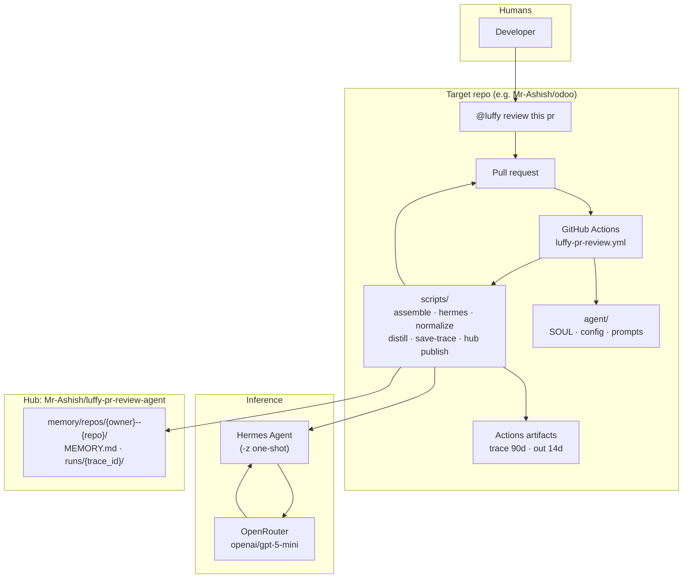
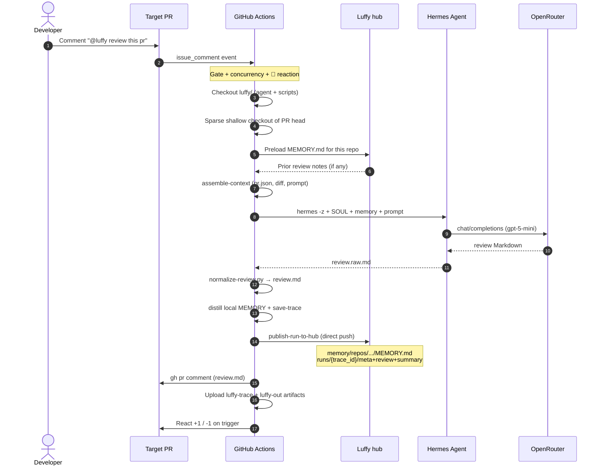
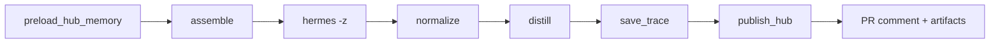

<p align="center">
  
</p>

<h1 align="center">Luffy — PR Review Agent</h1>

<p align="center">
  
  <strong>Comment-triggered PR reviews</strong> via
  <a href="https://github.com/nousresearch/hermes-agent">Hermes Agent</a>
  + <a href="https://openrouter.ai">OpenRouter</a>
  
</p>

<p align="center">
  <a href="https://github.com/Mr-Ashish/luffy-pr-review-agent/actions/workflows/luffy-pr-review.yml"></a>
  <a href="https://github.com/Mr-Ashish/luffy-pr-review-agent/actions/workflows/ingest-luffy-run.yml"></a>
  
</p>

Comment **`@luffy review this pr`** on a pull request → GitHub Actions runs Hermes + OpenRouter → Markdown review lands on the PR → **central hub memory** grows under [`memory/repos/`](memory/repos/).

## High-level architecture



**Pieces**

| Layer | Responsibility |
|--------|----------------|
| **Target repo** | Workflow install, secrets, PR comment trigger, runs the job |
| **Luffy scripts** | Context assembly, Hermes invoke, normalize, distill, hub publish |
| **Hermes + OpenRouter** | Model review of the PR |
| **Hub repo** | Durable per-repo memory + run summaries |
| **Artifacts** | Redacted per-run traces for audit |

## E2E flow



**Pipeline stages** (orchestrator)



## Trigger

```text
@luffy review this pr
@luffy review
```

Also: **Actions → Luffy PR Review → Run workflow** (manual PR number).

## Setup (target repo)

1. Copy `agent/`, `scripts/`, and `.github/workflows/luffy-pr-review.yml` onto the **default branch**.
2. Secrets:
   - `OPENROUTER_API_KEY` — model calls  
   - `LUFFY_HUB_TOKEN` — PAT that can push to this hub (for central memory)
3. Optional variables: `LUFFY_MODEL`, `LUFFY_HUB_REPO`, `LUFFY_HUB_MODE`
4. Comment on a PR: `@luffy review this pr`

## Local dry-run

```bash
# .env has OPENROUTER_API_KEY (gitignored)
./scripts/review-local.sh owner/repo 123
POST_COMMENT=1 ./scripts/review-local.sh owner/repo 123
```

## Traces

Each run packages a redacted trace:

```text
.luffy-out/traces/pr{N}-run{id}-a{attempt}/
  meta.json  prompt.md  context.md  pr.diff
  review.raw.md  review.md  hermes.stderr  timings.json
```

Artifacts:

| Name | Retention |
|------|-----------|
| `luffy-trace-pr{N}-run{id}` | 90 days |
| `luffy-out-pr{N}-run{id}` | 14 days |

```bash
gh run download <run-id> -R owner/repo -n luffy-trace-pr1-run<run-id>
```

## Central hub memory

After each run, the target publishes into **this** repo:

```text
memory/repos/{owner}--{repo}/
  MEMORY.md
  latest.json
  runs/{trace_id}/meta.json|review.md|summary.md
```

See [memory/README.md](memory/README.md) and [docs/OPERATIONS.md](docs/OPERATIONS.md).

## Brand

| Asset | Path |
|-------|------|
| Mark (SVG) | [`assets/luffy-mark.svg`](assets/luffy-mark.svg) |
| Mark (PNG) | [`assets/luffy-mark.png`](assets/luffy-mark.png) |
| Favicon | [`assets/favicon.png`](assets/favicon.png) |
| Twemoji accents | [`assets/twemoji-*.png`](assets/) (CC-BY 4.0 Twitter) |

## Docs

- [Architecture](docs/ARCHITECTURE.md)
- [Operations](docs/OPERATIONS.md)

## Layout

```text
agent/          SOUL, prompts, Hermes config, memory seed
scripts/        assemble → hermes → normalize → distill → hub publish
memory/         central per-repo MEMORY (hub)
assets/         brand mark + favicon
.github/workflows/
  luffy-pr-review.yml
  ingest-luffy-run.yml
```

## v1 limits

- PR **comment** reviews (not inline threads yet)
- Large diffs truncated (`MAX_DIFF_BYTES`)
- Hermes installed on the runner (Docker pin later)

---

<p align="center">
  
  <em>Luffy · Hermes Agent · OpenRouter · memory-backed review</em>
</p>
